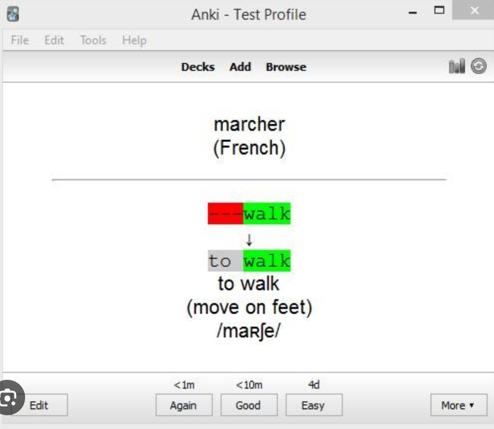

# A2 Write-up

## Broad application goals

The app I am building is named **Akarānga**, which means cultural heritage in Kirundi. It is a social media app targeted at communities whose cultures and languages are endangered. Akarānga provides those communities with a space where they can connect, learn, and document their cultural heritage and language.

## Scrapbook of comparables

**Youtube.com : Homepage**  The video-based digital archive idea for culture heritage documentation could borrow from Youtube general layout of videos on the homepage
   

**Youtube.com: The explore sidebar on the home page**  Having categories available to the user so that they can browse cultural content by category
   

**howtopronounce.com** : Pronounciations for the word captivating 
Users could contribute audio recordings to cultural texts on the Akaranga platform in a similar fashion, with multiple recordings ranked by rating
   

**Reddit**: User details 
The Akaranga platform could have a karma feature where users would accrue karma based on the quantity and quality of their contributions and this would confer them extra moderation capabilities, enabling the most invested users to have more impact on the content on the platform
   

**Urban dictionary**: Word definition on the home page 
The Akaranga platform could have a collaborative dictionary feature where people can contribute and rate word definitions
   

**Dictionary.com: Word of the day**  
The Akaranga platform could have a daily wisdom feature where users get a daily notification of a word, expression, proverb, or bit of cultural trivia. This would provide them with an easy way to learn something new about their culture and language every day
   

**Ankiweb.net: An example of a flashcard in the Ankiweb desktop client** 
The Akaranga platform could aggregate words that a user learns from videos and texts on the platform into a flashcard interface to enable them to easily review new material
   

**Instagram: A story quiz** 
Users could contribute and play quizzes on vocabulary and culture trivia on the platform, providing a fun and interactive way to learn about their culture and language 

## Feature ideas

1. **Cultural text posting**:
Users can post transcriptions of cultural texts such as folktales, chants, poetry, proverbs, nursery rhymes, legends, myths and more

2. **Video posting**:
Users can post videos on a broad range of culture and language-related subjects such as history, art, music, poetry, customs, and other cultural artifacts

3. **Cultural text audio recordings**:
Users can contribute audio recordings of cultural texts posted on the platform. Those recordings can be rated by users and ranked so that users who wish to listen to the text can easily access the highest-quality recordings.

4. **Cultural text translation**:
Users can translate cultural texts on the platform. This will make the texts accessible to community members learning the culture and people from around the world

5. **Content Word Builder section**:
Videos and texts posted on the platform have a word builder section where some of the words and expressions present in the videos or texts are explained. Users can request that new words or expressions from the video or text be added and they can contribute explanations

6. **Video subtitles**:
Users can contribute subtitles to videos in the native language, as well as other languages commonly spoken by the diaspora. This makes videos more accessible to community members learning the language.

7. **Quizzes feature**:
Users can contribute and play vocabulary and trivia multiple-choice quizzes. This would make it easier for community members to improve their proficiency in the language and knowledge of the culture

8. **Collaborative dictionary**:
Users can contribute definitions and usage examples of words either through the content word builder section of videos and texts or directly add them to the dictionary. Users can also look up words using the dictionary

9. **Flashcards feature**:
Words and expressions that users look up in other sections of the platform such as word builder section in videos and texts, as well as quiz questions, are aggregated in a flashcard interface that enables them to easily review newly learned material

10. **Content editing**:
Users can improve the quality of existing content on the platform by suggesting edits for various types of content such as video subtitles and text translations

11. **Content tagging**:
Users can add tags to videos and texts they post to provide information related to topics and sub-topics their content is about, which can be useful for categorization and recommendation of content on the platform

12. **Search**:
Users can look for specific content by using a search interface where they can add a query and the platform would return query-specific results.

13. **Content reporting and moderation**:
Users can report content that is inaccurate or inappropriate, providing a means to moderate content on the platform

14. **User karma**:
Users can accrue karma based on the quantity and quality of their contributions, which, in turn, provide them with extra privileges in terms of contributions or edits they are allowed to make on the platform. Experts on the culture and language can also be given extra moderation and editing privileges to improve the quality of content on the platform.

15. **Daily wisdom**:
Users get a daily notification of a word, expression, or proverb in the language and they can add it to the flashcard feature for later review. This will provide an easy way for people to learn something every day about their language or culture

16. **Contribution suggestion feature**:
Users who wish to contribute content can get access to contribution suggestions based on common search queries that do not yet have relevant results on the platform. This would be especially useful at the beginning when content is still scarce on the platform. Search queries would be a rich source of content inspiration

17. **Subcommunities**:
Users can subscribe to subcommunities, enabling them to contribute and explore videos and texts centered around specific cultural or language topics

18. **Sharing feature**:
Community members can share platform content via links that can be shared on other apps and platforms

19. **Subscribing feature**:
Users can subscribe to a particular community member’s content, allowing them to be notified when that member posts new content and to have more of that member’s content in their recommendations

20. **Content discovery and recommendation**:
Users are introduced to new content about their culture and language when they open the platform that is tailored to their preferences and history

21. **Commenting feature**:
Users can comment on videos and texts, providing community members a space to discuss the content and learn from each other

Collaboration note: I did not have collaborators during this brainstorming

## VSD Analysis

## Storyboarding and sketching

### Learning about culture through the video archive

### Learning about language through quizzes

