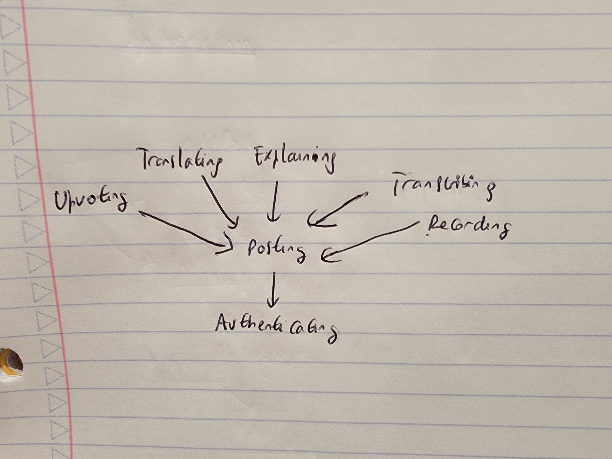
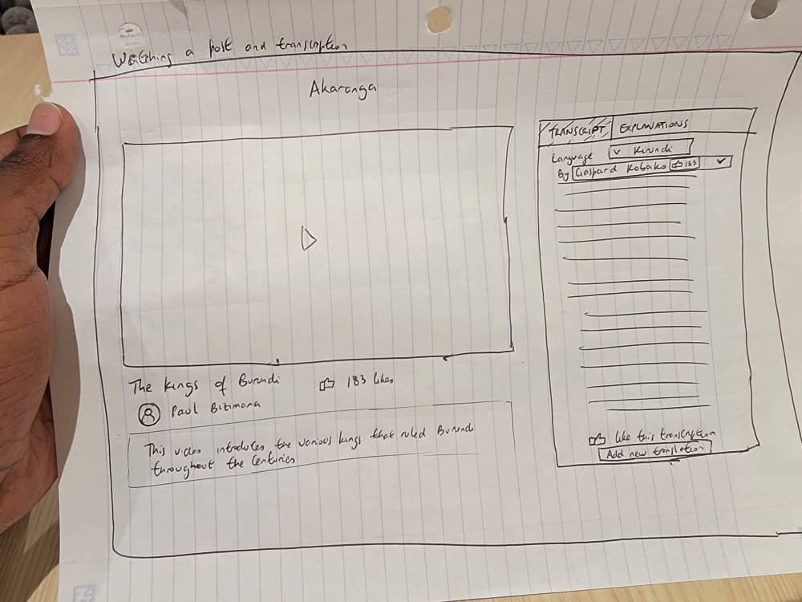
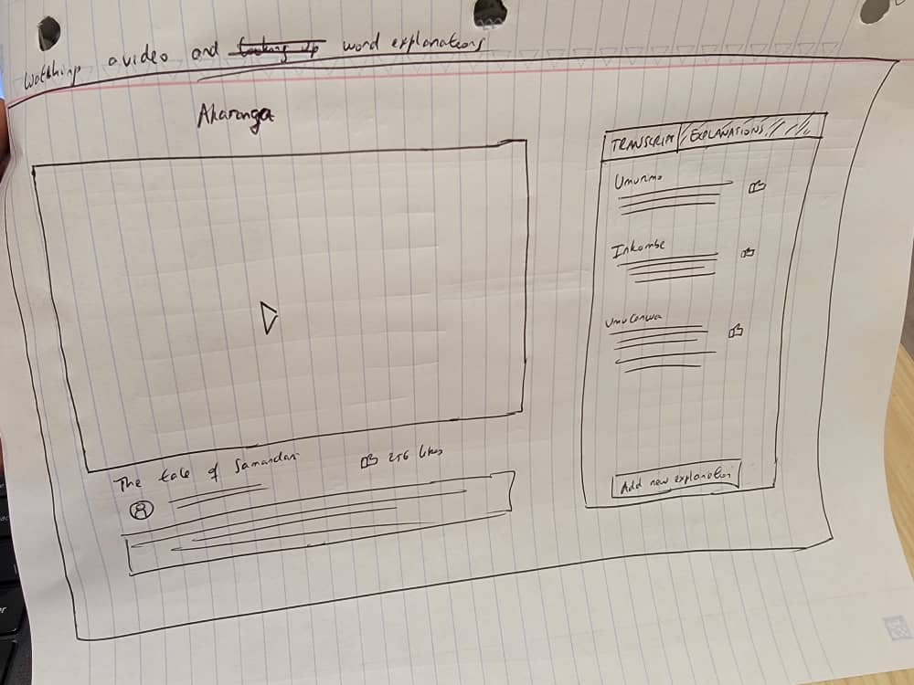
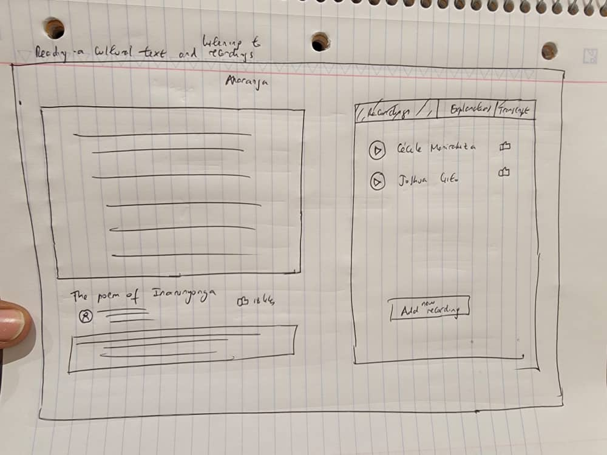

# A3 Write-up

## Pitch

Are you worried about the state of your culture and language and want to learn more about it, connect with other speakers and contribute in preserving it? Akaranga is a social media app targeted at communities whose cultures and languages are endangered and provides them with a space where they can connect, learn, and document their cultural heritage and language. Content is made more accessible to community members yearning to learn about their cultural heritage through transcription and translation tools, as well as an explainer feature that enable you to learn difficult words and expressions. Akaranga harnesses the power of crowsourcing to enable communities to directly take part in the preservation of the cultural heritage. Learning about and contributing to your cultural heritage has never been this easy!

## Functional Design

### Concepts

POSTING [User]
Purpose: Share content with other people

Principle: After user u share content c, it is made available to other users

State:  
posts: set Post 
author: Post -> one User 
content: Post -> one Content 

Actions:

addPost(u: User, c: Content, out p: Post) 
  posts += p 
  p.author := u 
  p.content := c
  
getPostsBy(u: User, out P: set Post) 
  P := u.~author

 

TRANSCRIBING [User, Content] 
Purpose: Provide transcriptions of audio-based content

Principle: After user u adds a transcription t of content c, looking up transcriptions of c will yield a set of transcriptions T including t

State: 
transcriptions: Content -> set Transcription 
transcribedBy: Transcription -> one User 
transcript: Transcription -> one String 

Actions

addTranscription(u: User, c: Content, s: String, out t: Transcription) 
  c.transcriptions += t 
  t.transcribedBy :=u 
  t.transcript := s

getTranscriptions(c: Content, out T: set Transcription) 
  T := c.transcriptions

TRANSLATING [User] 
Purpose: Making content more accessible to users

Principle: After adding a translation s’ of string s from language l to language l’, looking up translations of s from language l to language l’ will include s’

State: 
translations: Content -> set Translation 
translatedBy: Translation -> one User 
translated: Translation -> one String 
sourceLanguage, targetLanguage: Translation -> one Language

Actions 
addTranslation(u: User, c: Content, l: Language, l’: Language, s’: String, out t: Translation) 
 c.translations += t 
 t.translatedBy := u 
 t.translated := s’ 
 t.sourceLanguage := l 
 t.targetLanguage := l’

getTranslations(Content c, out T: set Translation) 
 T := c.translations

RECORDING [User, Content] 
Purpose: Provides audio recordings of textual content

Principle: After user u add a recording r for content c, that recording will be added to the set of recordings R for content c, and looking up recordings of c will yield R

State:  
recordings: Content -> set Recording 
recordedBy: Recording -> one User

Actions

addRecording(u: User,  c: Content, r: Recording) 
  c.recordings += r 
  r.recordedBy := u

getRecordings(c: Content, out R: set Recording) 
  R := c.recordings

EXPLAINING [User, Content] 
Purpose: Provide crowdsourced explanations of words or expressions in content 

Principle: After a user u adds an explanation e for a string s in content t, that explanation is added to the explanations available to other users for that content

State: 
substrings: Content -> set String 
explanations: Content -> set Explanation 
entry: Explanation -> one String 
explainedBy: Explanation -> one User 
definition: Explanation -> one String 
example: Explanation -> String

Actions

addExplanation(u: User, c: Content, s: String, d: String, ex: String out e: Explanation) 
 s in c.substrings 
 c.explanations += e 
 e.entry := s 
 e.explainedBy := u 
 e.definition := d 
 e.example := ex
 
getExplanations(c: Content, out E: set Explanations) 
 E := c.explanations

UPVOTING [User, Item] 
Purpose: Rank user contributions based on crowdsourced approvals

Principle: After a series of votes on items, items are ranked by their number of votes

State 
upvotes: Item -> set Users
 
Actions:

upvoteItem(u: User, i: Item) 
  u not in i.upvotes 
  i.upvotes += u

AUTHENTICATING 
Purpose: Authenticate users

Principle: After a user registers with a username and password, they can authenticate as that user by providing a matching username and password

State: 
registered: set User 
username, password: registered -> one String

Actions:

register(n: String, p: String, out u: User) 
   u not in registered 
   add u to registered 
   set n as username of u 
   set p as password of u

authenticate(username:String, password: String, out u:User) 
   u in registered

### App-level actions

app Akarānga
include Authenticating 
include Posting[Authenticating.User] 
include Transcribing[Authenticating.User, Posting.Post] 
include Translating[Authenticating.User, Posting.Post] 
include Transcribing[Authenticating.User, Posting.Post] 
include Recording[Authenticating.User, Posting.Post] 
include Explaining[Authenticating.User, Posting.Post] 

include Upvoting[Posting.Post] 
include Upvoting[Translating.Translation] 
include Upvoting[Transcribing.Transcription] 
include Upvoting[Recording.Recording] 

sync upvotePost(u: User, p: Post) 
 Upvoting.upvoteItem(u, p)

sync upvoteTranslation(u: User, t: Translation) 
 Upvoting.upvoteItem(u, t)

sync upvoteTranscription(u: User, t: Transcription) 
 Upvoting.upvoteItem(u, t)

sync upvoteExplanation(u: User, e: Explanation) 
 Upvoting.upvoteItem(u, e)

sync transcribePost(post: Post) 
  Transcribing.addTranscription(post)

sync recordPost(user u, p: Post, r: Recording) 
  Recording.addRecording(u, p, r)

sync translatePost(u: User, p: Post, translation: String, from: Language, to: Language) 
  Translating.addTranslation(u, p, from, to, translation)

sync explainPost(u: User, p: Post, s: String, d: String, e: String) 
  Explaining.addExplanation(u, p, s, d, e)

### Dependency Diagram

## Wireframes
 
 
 