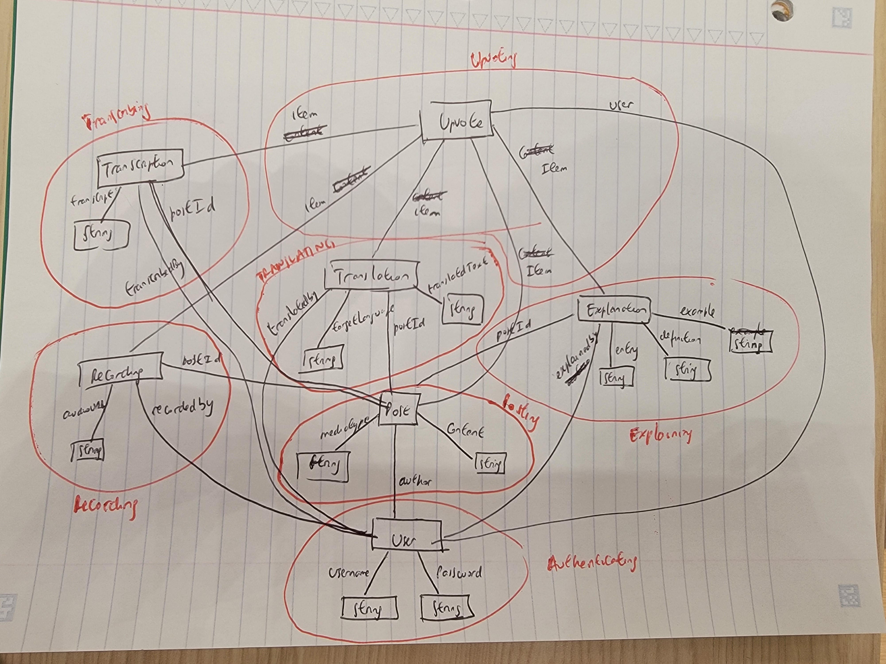

# A4 Write-up

## Abstract Data Models

<h3>POSTING [User]</h3>

<u>Purpose</u>: Share content with other people

<u>Principle</u>: After user u shares content c, it is made available to other users

<u>State</u>: 
posts: set Post 
author: Post -> one User 
content: Post -> one Content 
mediaType: Post -> one MediaType 
textPosts, audioPosts, videoPosts -> set Post 

<u>Actions</u>: 
addPost(u: User, m: MediaType, c: Content, out p: Post) 
  posts += p 
  p.author := u 
  p.mediaType := m 
  p.content := c 
  
deletePost(p: Post) 
  posts -= p 

getAllPosts(out P: set Post) 
  P := posts 

getPostsBy(u: User, out P: set Post) 
  P := u.~author 

isReadable(p: Post) 
  p in textPosts

isListenable(p: Post) 
  p in audioPosts or p in videoPosts

<h3>TRANSCRIBING [User, Item]</h3> 

<u>Purpose</u>: Provide transcriptions of audio-based content

<u>Principle</u>: After user u adds a transcription t of item i, looking up transcriptions of i will yield a set of transcriptions T including t

<u>State</u>: 
transcriptions: Item -> set Transcription 
transcribedBy: Transcription -> one User 
transcript: Transcription -> one String 

<u>Actions</u>: 
addTranscription(u: User, i: Item, s: String, out t: Transcription) 
  i.transcriptions += t 
  t.transcribedBy :=u 
  t.transcript := s 

getItemTranscriptions(i: Item, out T: set Transcription) 
  T := i.transcriptions 

<h3>TRANSLATING [User, Item]</h3>

<u>Purpose</u>: Making content more accessible to users

<u>Principle</u>: After adding a translation s of item i to language l, looking up translations of i will include s

<u>State</u>: 
translations: Item one -> set Translation 
translatedBy: Translation -> one User 
translated: Translation -> one String 
targetLanguage: Translation -> one Language 

<u>Actions</u>: 
addTranslation(u: User, i: Item, l: Language, s: String, out t: Translation) 
 i.translations += t 
 t.translatedBy := u 
 t.translated := s’ 
 t.targetLanguage := l’ 

getItemTranslations(Item i, out T: set Translation) 
 T := i.translations 

<h3>RECORDING [User, Item]</h3>

<u>Purpose</u>: Provides audio recordings of text-based content

<u>Principle</u>: After user u adds a recording r with audio a for item i, that recording will be added to the set of recordings R for item i, and looking up recordings of i will yield R

<u>State</u>: 
recordings: Item -> set Recording 
recordedBy: Recording -> one User 
audio: Recording -> one Audio 

<u>Actions</u>: 
addRecording(u: User,  i: Item, a: Audio, out r: Recording) 
  i.recordings += r 
  r.recordedBy := u 
  r.audio := a 

getItemRecordings(i: Item, out R: set Recording) 
  R := i.recordings

<h3>EXPLAINING [User, Item]</h3>

<u>Purpose</u>: Provide crowdsourced explanations of words or expressions in content

<u>Principle</u>: After a user u adds an explanation e for item i, looking up explanations of i will include e

<u>State</u>: 
explanations: Item -> set Explanation 
entry: Explanation -> one String 
explainedBy: Explanation -> one User 
definition: Explanation -> one String 
example: Explanation -> String 

<u>Actions</u> 
addExplanation(u: User, i: Item, s: String, d: String, ex: String, out e: Explanation) 
 i.explanations += e 
 e.entry := s 
 e.explainedBy := u 
 e.definition := d 
 e.example := ex 
 
getItemExplanations(i: Item, out E: set Explanations)
 E := i.explanations

<h3>UPVOTING [User, Item]</h3>

<u>Purpose</u>: Rank user contributions based on crowdsourced approvals

<u>Principle</u>: After a series of votes on content, content is ranked by their number of votes

<u>State</u> 
upvotes: Item -> set Users
 
<u>Actions</u>: 
upvoteItem(u: User, i: Item) 
  u not in i.upvotes 
  i.upvotes += u 

removeItemUpvotes(i: Item) 
  i.upvotes = None 

<h3>AUTHENTICATING</h3>

<u>Purpose</u>: Authenticate users

<u>Principle</u>: After a user registers with a username and password, they can authenticate as that user by providing a matching username and password

<u>State</u>: 
registered: set User 
username, password: registered -> one String 

<u>Actions</u>: 
register(n: String, p: String, out u: User) 
   u not in registered 
   add u to registered 
   set n as username of u 
   set p as password of u 

authenticate(username:String, password: String, out u:User) 
   u in registered 

### App-level actions

app Akarānga
include Authenticating 
include Posting[Authenticating.User] 
include Transcribing[Authenticating.User, Posting.Post] 
include Translating[Authenticating.User, Posting.Post] 
include Transcribing[Authenticating.User, Posting.Post] 
include Recording[Authenticating.User, Posting.Post] 
include Explaining[Authenticating.User, Posting.Post] 

include Upvoting[Posting.Post] 
include Upvoting[Translating.Translation] 
include Upvoting[Transcribing.Transcription] 
include Upvoting[Recording.Recording] 

sync deletePost(post: Post) 
 When Posting.deletePost(post) 
  Transcribing.deleteItemTranscriptions(post) 
  Recording.deleteItemRecordings(post) 
  Translating.deleteItemTranslations(post) 
  Explaining.deleteItemExplainations(post) 
  Upvoting.removeItemUpvotes(post) 

sync transcribePost(post: Post) 
 When Posting.isListenable(post) 
  Transcribing.addTranscription(post)

sync recordPost(user u, p: Post, r: Recording) 
 When Posting.isReadable(post) 
  Recording.addRecording(u, p, r) 

sync translatePost(u: User, p: Post, translation: String, from: Language, to: Language) 
  Translating.addTranslation(u, p, from, to, translation)

sync explainPost(u: User, p: Post, s: String, d: String, e: String) 
  Explaining.addExplanation(u, p, s, d, e)

sync upvotePost(u: User, p: Post) 
 Upvoting.upvoteItem(u, p)

sync upvoteTranslation(u: User, t: Translation) 
 Upvoting.upvoteItem(u, t)

sync upvoteTranscription(u: User, t: Transcription) 
 Upvoting.upvoteItem(u, t)

sync upvoteExplanation(u: User, e: Explanation) 
 Upvoting.upvoteItem(u, e)

## Data model
 

## Useful links
- [Backend repository](https://github.com/mucowintore/61040-a4-backend)
- [Vercel deployment](https://61040-a4-backend-seven.vercel.app/)