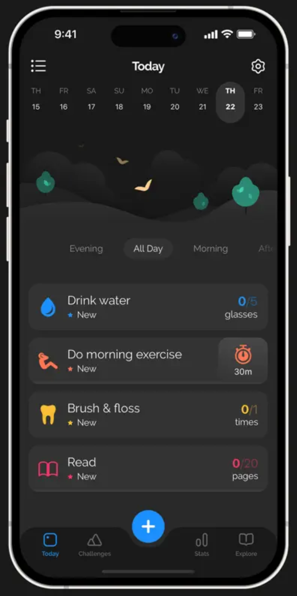

# L13: User Study Experiment

I thoroughly enjoyed Monday’s lecture on user testing and decided to put the concepts learned in class into practice by conducting a small user study with a real user. My goal in doing so was to practice the concepts learned in class in a real-world context and hopefully gain a better understanding of the process.

## Context

My goal for this user study was for it to be simple enough to be prepared and carried out fairly quickly while enabling me to gain valuable insights into the user testing process and learn some useful lessons.

I decided to conduct the user study with a friend of mine. As I was considering what app to test, my goal was to look for an app that I was quite familiar with but that my friend had not used in the past. I also ensured that he had not used another app similar in function before so that the experience be as novel to him as possible.

  

I ended up choosing a habit-tracking app I use regularly called [Productive](https://productiveapp.io/). My friend had not used habit-tracking apps in the past, so I thought it would be a good candidate for the experiment. Productive enables users to easily track their habits and provides visually-pleasing statistics and helpful check-ins to keep you motivated.

For the user study, I asked my friend to perform three tasks: 
    - Add a new habit of his choice in the app 
    - Log completion of that habit 
    - Access the habit statistics

     
Right before we started, I made sure to do a couple of things:
- I briefed my friend on what I was trying to achieve, and that the goal was not to evaluate him, but rather to evaluate the design of the app
- Given that we conducted the user study remotely, we first did a technical check that involved having my friend share their phone screen via WhatsApp and open an app on their phone to make sure our setup worked properly and I could both see him and the app interface
- I encouraged the user to talk out loud so that I could know what they were thinking as they were testing the app

## Observations and takeaways

The user study lasted about 20 minutes and although it was rather short, it was very informative. Here are my main takeaways:

- I found the briefing before the user study to be essential to the success of the user study. This was the first time my friend was taking part in such an experiment, and he was a bit nervous at the beginning, asking me questions to ensure he doesn’t get it wrong. Emphasizing that the design of the app was what was being evaluated here seemed to help bring his worries to rest.

- The technical check before the user study turned out to be very important. We encountered a couple of hiccups and confusion while doing it, so ensuring those were cleared before the user study helped make the experiment itself go smoothly.

- Although my friend talked out loud at the beginning of the study as instructed, he went silent once he reached parts of the interface where he wasn’t quite sure what to do. This showed me that prompting is an essential part of the process, as my friend tended to go silent precisely when I needed to know what was going on.

- Sometimes when stuck, my friend would ask me point-blank what to do. I found that it’s not as easy as it seems to strike a balance between nudging the user in the right direction and avoiding interfering too much. I think choosing in advance when to intervene, as suggested in class, would help with this.
