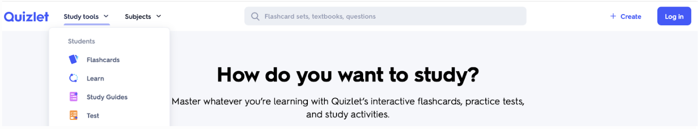
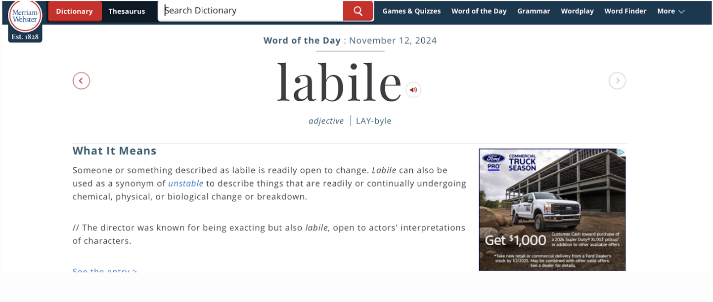
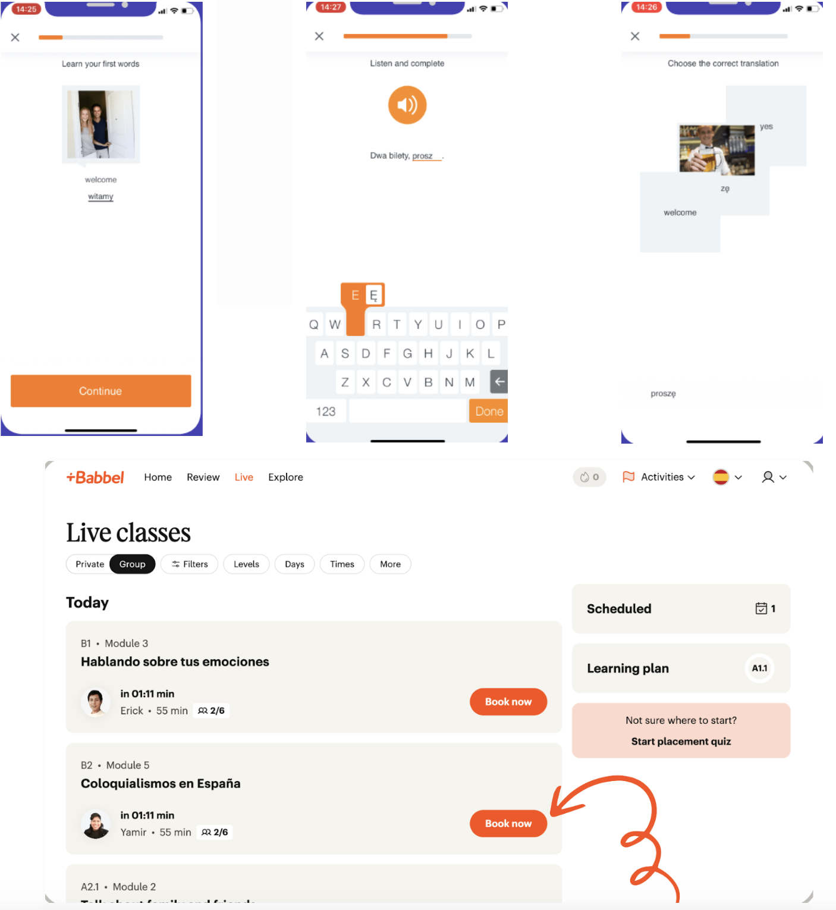
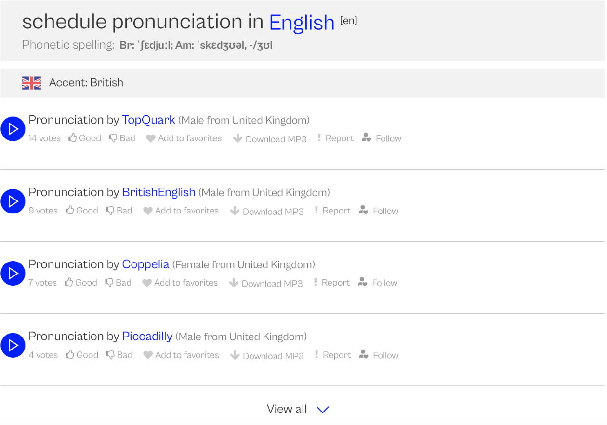
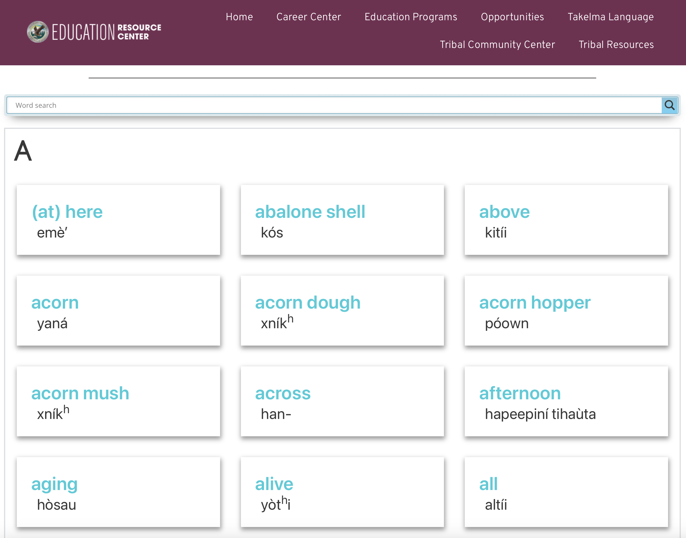
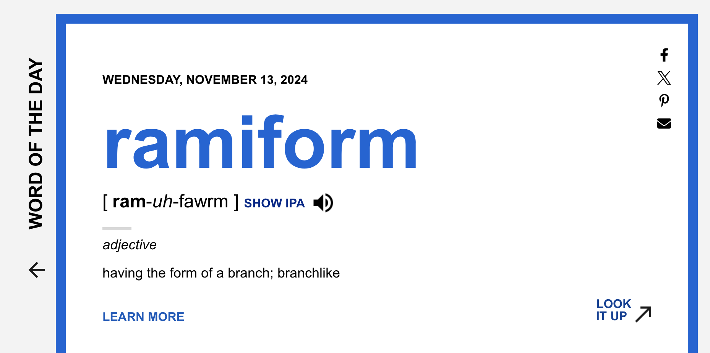
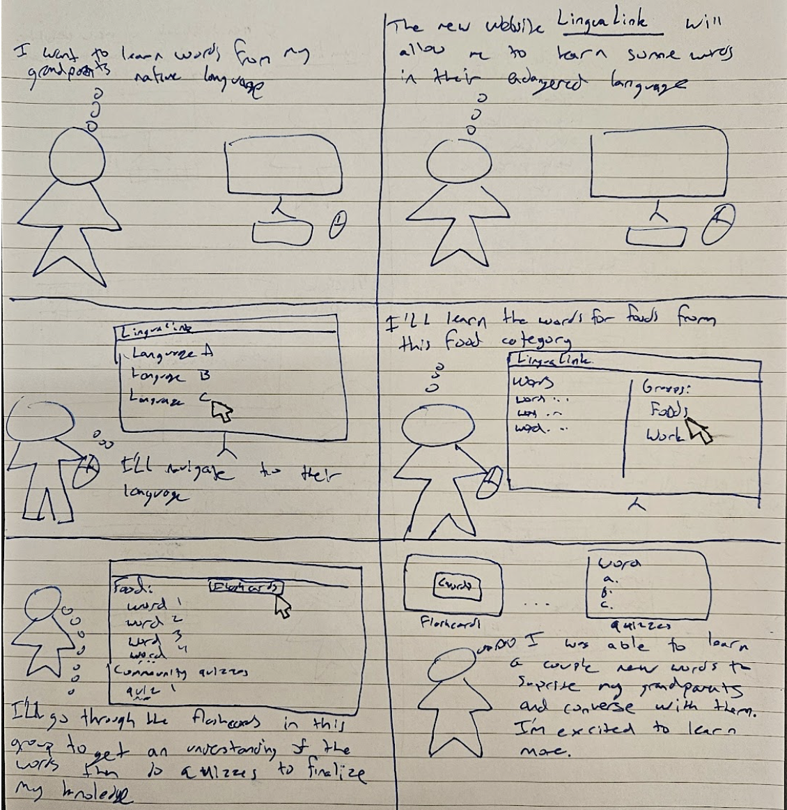

# Project Phase 2: Divergent Design
13 November 2024

## Broad Application Goals 
LinguaLink is a platform targeted towards communities with endangered languages that empowers them to lead preservation efforts of their language through crowdsourcing tools in a collaborative dictionary. LinguaLink also provides learning features to foster intergenerational transmission of the language through flashcards and quizzes that highlight different aspects of a culture's heritage. Beyond existing solutions in the problem domain, LinguaLink provides one centralized location for communities to document their endangered language and provides tooling for members of these communities to help teach future generations.

## Scrapbook of Comparables

This snippet comes from quizlet.com which is a website that provides personalized quizzes and practice tests. This could be useful to our design brainstorming because we would want to include some similar functionalities that are part of their study tools. Their use of icons and spacing make it an easy website to navigate which are things we can take into account when designing our website. 

This is a screenshot from Merriam-webster’s word of the day page. This could be useful to our design brainstorming because we could use a similar idea for having a word of the day feature and also the spacing of the word, the audio and the definition could inform us of a useful way to implement this system. 

Babbel shows different ways to approach learning exercises, as well as suggesting a Live classes feature. This language learning app provides an adjacent purpose to our project making it ripe for inspiration.

This is the homepage of Forvo.com. We could draw inspiration from the way Forvo allows users to contribute multiple pronunciations for words, especially given that we want to enable communities to contribute word pronunciations. 

This is a dictionary list page from Cow Creek Education for their online Takelma language dictionary. This could be useful inspiration for the layout of our various dictionary list pages.

This is an expanded view on a word in Dictionary.com. This could be useful inspiration for the general layout of the expanded word views in our app.

## Brainstorming Features
- Dictionary: Users can look up definitions of words in their language
- Crowdsourcing feature: Users can contribute word definitions and examples to the dictionary
- Quizzes: Users can make use of multiple choice questions to assist in learning vocabulary.
- Flashcards: Users can use flashcards to test their knowledge of vocabulary.
- Translation feature: Users can find translations of dictionary entries in a variety of languages
- Word of the Day: Users can get a daily notification of a new word to learn, so that users can learn something new about their language on a daily basis
- Friends: Users can be friends with other users and share quizzes and words that they find interesting
- Pronunciation: Users can provide pronunciation recordings for words to help community members who are learning the language
- Images: Users can upload images that correspond to the definition of different words so they can associate words with an image
- Upvoting: The community can rate user contributions as a means to moderate the quality and accuracy of the content on the platform.
- Karma: Users who submit words can gain karma which can allow them to access moderation features at certain thresholds.
- Moderation: Users with moderation permissions can remove, or adjust entries.
- Streak: The app can keep track of how many days in a row the user has used the app to learn a new word to help users be motivated and consistent in their learning.
- Suggest Word to be defined: Learners of the language within the community can suggest unfamiliar words they would like more proficient community members to explain
- Organization of Dictionary: Words in the dictionary will be organized either alphabetically or by category so it is easier for a user to navigate through the words and also learn similar words at once. 
- Thesaurus Feature: Users can link to synonyms when adding an entry, which would link both ways. Allowing other users to find similar words.
- Media Section: Users can submit media for a language, such as stories, songs, or recording, to familiarize other users with the language.
- Regionality: Users can submit their region when adding words, to indicate what dialect their words may be from.
- Goals Tracker: Users can set goals for words to learn, and take quizzes to assess their progress, until they achieve mastery of the words.
- Idiomatic Expressions: A part of the dictionary could be dedicated to idioms, sayings or proverbs in that language 
- Search Feature: Users can search for words in the translation language, original language, or by some other property of the word.
- Map: Indicates where a language is spoken, includes a gradient to show where many speak it and where few speak it.
- Find community members near you: Enable community members to connect based on geographical proximity
- Tagging: Users can tag a word and then all words related to the tag will be categorized together
- Grouping: After selecting many objects, users provide a name to this selection, which users can later find the group by.
- Events: Community events, such as word drives could be scheduled
- Subcommunities: Forums where community members can have discussions about specific aspects of their language and culture (e.g traditional cooking recipes, poetry, etc)
- Profile: Users can keep a profile with some information about them
- Statistics: Users can keep track of how many words they have learned, and how long they have been learning certain languages
- Crossword Puzzle: Users can complete a crossword puzzle based on the endangered language wordbase
- Endangered Wordle: Users can complete a Wordle based on the endangered language wordbase 
- Achievements: Users can get achievements for learning a certain number of words, or doing a certain number of flashcards.

## Outlining Your App
### Dictionary-ing
- Purpose: To document words in the language 
- Operational Principle: After adding a word entry in the dictionary, users will be able to find relevant information about that word in one location.
### Flashcarding
- Purpose: To help facilitate the learning process of words for users
- Operational Principle: After getting a flashcard, a user will see a defining representation of a word on one side of the flashcard and the word itself on the other side.
### Quizzing
- Purpose: Purpose: To learn about various aspects of the language and culture
- Operational Principle: After creating a quiz, users can take the quiz and select from multiple answer options, after which the website will inform them if they selected the correct one.
### Upvoting
- Purpose: Rank community contributions based on user approval
- Operational Principle: After an item gets upvoted, its associated number of upvotes increases by 1. This number is visible to all users.
### Grouping
- Purpose: To associate any objects with each other, such that other users can utilize these objects together.
- Operational Principle: After selecting many objects, users provide a name to this selection, which users can later find the group by.
### Tagging
- Purpose: To categorize objects united by a terse theme inherent to the objects
- Operational Principle: After tagging an object with x category, that object will be associated with other objects tagged with x category.
### Searching
- Purpose: To allow users to look up items they are interested in
- Operational Principle: After searching for some property of an object, the object will show up with all of its associated values if it exists, and no entries will appear if it doesn't. 

## Storyboard and Sketches
Storyboard one focuses on a user trying to learn some words in a language that the person’s grandparents speak but they are not very familiar with the language. 

We found clicking through multiple tabs to add a word to be a minor point of friction

Storyboard two focuses on a user trying to add vocab from their native language to the online dictionary to help other users learn. 

