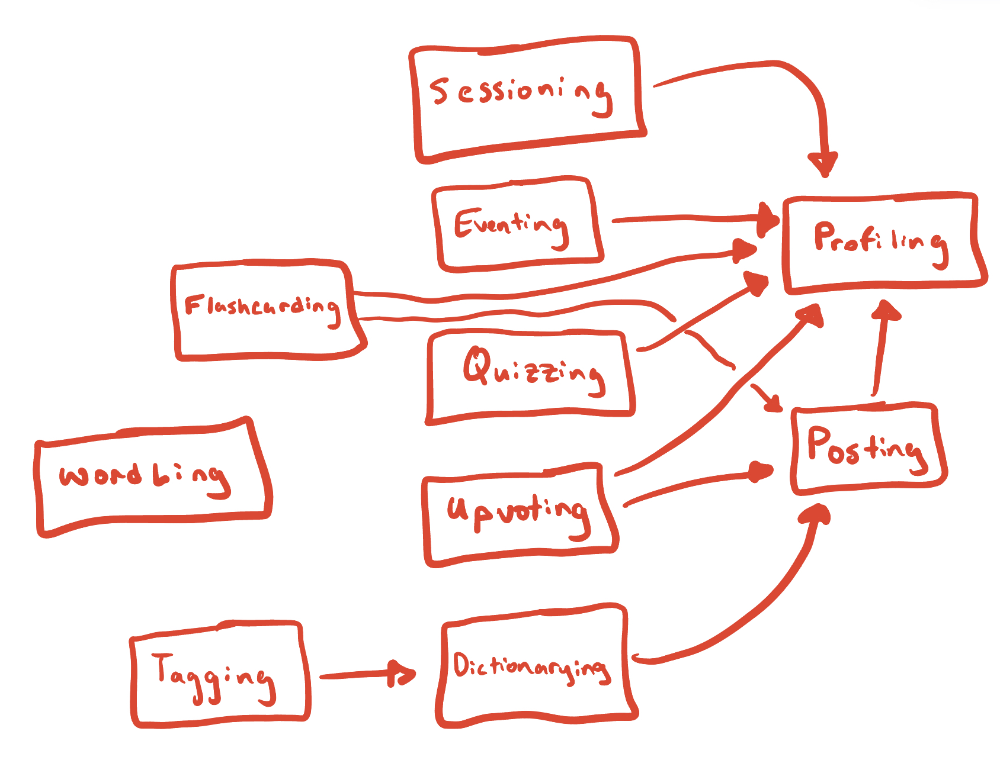
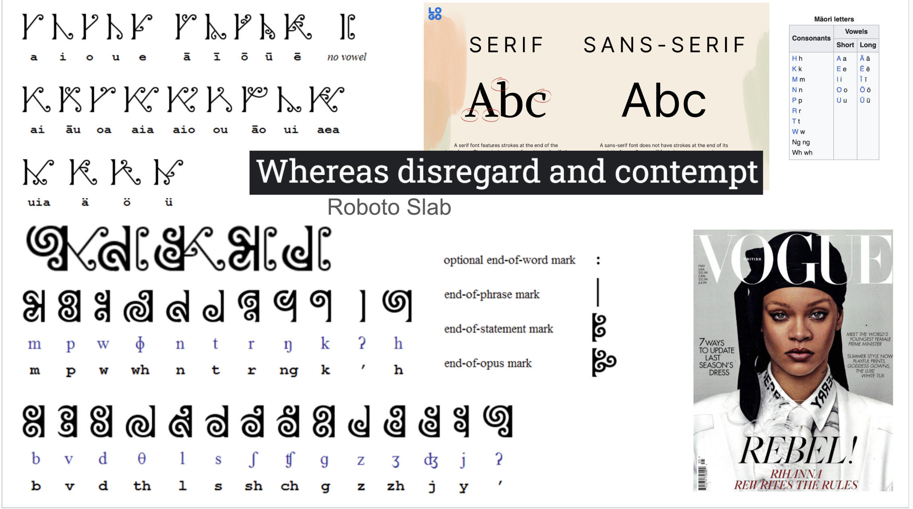

# P3

## Functional Design

### Concepts

#### Posting[User, Content]

**Purpose**: Users can post items for other users  
**Operational Principle**: After making a post, that post is available to other users unless it is deleted  
**State**:  
- `posts`: set Post  
- `author`: Post -> one User  
- `body`: Post -> Content  

**Actions**:  
- `create (user: User, body: Content, out post: Post)`  
  - `post.body := body`  
  - `posts += post`  
- `delete (user: User, post: Post)`  
  - `post.author == user`  
  - `posts -= post`  
- `update (user: User, post: Post, body: Content)`  
  - `post.author == user`  
  - `post.body = body`  

---

#### Dictionarying[Item]

**Purpose**: To map a word to a set of items  
**Operational Principle**: After making a dictionary entry, a user will be able to see all of the items defining a word  
**State**:  
- `dictionary`: set Entry  
- `word`: Entry -> one String  
- `items`: Entry -> set Item  

**Actions**:  
- `createEntry (word: String, item: Item, out entry: Entry)`  
  - `entry.word := word`  
  - `entry.item += item`  
  - `dictionary += entry`  
- `deleteEntry (entry: Entry)`  
  - `dictionary -= entry`  
- `addItem (entryWord: String, item: Item, out entry: Entry)`  
  - `entry := entryWord.~word`  
  - `entry.items += item`  
- `deleteItem (entryWord: String, item: Item)`  
  - `entry := entryWord.~word`  
  - `entry.items -= item`  
- `entryExists (entryWord: String, out exist: Boolean)`  
  - `exist := (entryWord.~word) != undefined`  
- `getEntry (entryWord: String, out entry: Boolean)`  
  - `entry := entryWord.~word`  

---

#### Flashcarding[User, Item]

**Purpose**: To help facilitate the learning process of words for users  
**Operational Principle**: After a user creates a collection of flashcards by adding words to it, they will be able to study this flashcard collection later.  
**State**:  
- `collections`: set Collection  
- `author`: Collection -> one User  
- `name`: Collection -> String  
- `items`: Collection -> set Item  

**Actions**:  
- `createCollection(u: User, collectionName: String, items: set Item, out collection: Collection)`  
  - `collection.author = u`  
  - `collection.items = items`  
  - `collections += collection`  
- `deleteCollection(u: User, collectionName: String)`  
  - `collection := name.~collectionName`  
  - `u == collection.author`  
  - `collections -= collection`  
- `addToCollection(u: User, collectionName: String, i: Item)`  
  - `collection := name.~collectionName`  
  - `u == collection.author`  
  - `collection.items += i`  
- `removeFromCollection(u: User, collectionName: String, i: Item)`  
  - `collection := name.~collectionName`  
  - `u == collection.author`  
  - `collection.items -= i`  
- `getCollectionsByItem(i: Item, out collections: set Collection)`  
  - `collections = items.~i`  
- `removeItemFromCollections(i: Item)`  
  - `collections = items.~i`  
  - `collection.items -= i for collection in collections`  

---

#### Quizzing [User]

**Purpose**: To learn about various aspects of the language and culture  
**Operational Principle**: After a user creates a quiz, other users can take the quiz and select from multiple answer options, after which the website will inform them if they selected the correct one.  
**State**:  
- `quizzes`: set Quiz  
- `author`: Quiz -> one String  
- `questions`: Quiz -> set Question  
- `prompt`: Question -> one Prompt  
- `options`: Question -> set String  
- `answer`: Question -> one String  

**Actions**:  
- `createQuiz (user: User, questions: set Question, out quiz: Quiz)`  
  - `quiz.author := user`  
  - `quiz.questions := questions`  
  - `quizzes += quiz`  
- `deleteQuiz (user: User, quiz: Quiz)`  
  - `quiz.author == user`  
  - `quizzes -= quiz`  

---

#### Upvoting[User, Item]

**Purpose**: Rank community contributions based on reviewers’ approval  
**Operational Principle**: After an item gets upvoted, its associated approval rating increases by 1. After an item gets downvoted, its associated approval rating decreases by 1. A user can only upvote OR downvote. These votes are visible to all users.  
**State**:  
- `upvotes`: Item -> set Users  
- `downvotes`: Item -> set Users  
- `reviewers`: set Users  

**Actions**:  
- `upvoteItem(u: User, i: Item)`  
  - `u not in i.upvotes and i.downvotes`  
  - `u in reviewers`  
  - `i.upvotes += u`  
- `removeUpvote(u: User, i: Item)`  
  - `u in i.upvotes`  
  - `i.upvotes -= u`  
- `downvoteItem(u: User, i: Item)`  
  - `u not in i.downvotes and i.upvotes`  
  - `u in reviewers`  
  - `i.downvotes += u`  
- `removeDownvote(u: User, i: Item)`  
  - `u in i.downvotes`  
  - `u in reviewers`  
  - `i.downvotes -= u`  
- `getUpvoteCount(i: Item, out upvoteCount: Int)`  
  - `upvoteCount = size(i.upvotes)`  
- `getDownvoteCount(i: Item, out downvoteCount: Int)`  
  - `downvoteCount = size(i.downvotes)`  

---

#### Tagging[Item]

**Purpose**: To categorize objects united by a terse theme inherent to the objects  
**Operational Principle**: Users are provided with some predetermined tags and have the option to submit further tags for approval. After tagging an object with x category, that object will be associated with other objects tagged with x category.  
**State**:  
- `tags`: String -> set Item  

**Actions**:  
- `addTag(i: Item, t: Tag)`  
  - `tags.t += i`  
- `removeTag(i: Item, t: Tag)`  
  - `tags.t -= i`  
- `getItemsByTag(t: Tag, out items: set Item)`  
  - `Items = tags.t`  

---

#### Eventing[User]

**Purpose**: To allow users to share information about an event outside of the website, and allow other users to indicate their interest  
**Operational Principle**: After a user sets an event, other users can find the event by location and can indicate that they are interested in attending the event by RSVPing. An event organizer can indicate an event’s location, date, and set a limit on the number of attendees.  
**State**:  
- `events`: set Event  
- `organizer`: Event -> User  
- `when`: Event -> one Date  
- `where`: Event -> one String  
- `description`: Event -> one String  
- `rsvp`: Event -> set User  
- `maxAttendees`: Event -> one Int  

**Actions**:  
- `createEvent(u: User, when: Date, where: String, description: String, maxAtt: Int, out e: Event)`  
  - `e.organizer = u`  
  - `e.where = where`  
  - `e.when = when`  
  - `e.description = description`  
  - `e.maxAttendees = maxAtt`  
  - `events += e`  
- `deleteEvent (u: User, e: Event)`  
  - `e.organizer == u`  
  - `events -= e`  
- `updateEvent(u: User, when: Date, where: String, description: String, maxAtt: Int, out e: Event)`  
  - `e in events and e.organizer = u`  
  - `e.where = where`  
  - `e.when = when`  
  - `e.description = description`  
- `rsvpForEvent(u: User, e: Event)`  
  - `size(e.rsvp) < e.maxAttendees`  
  - `u not in rsvp.e`  
  - `rsvp.e += u`  
- `unrsvpForEvent(u: User, e: Event)`  
  - `u in rsvp.e`  
  - `rsvp.e -= u`  
- `checkRSVP (u: User, e: Event, out registered: Boolean)`  
  - `registeredEvents := rsvp.~u`  
  - `registered := e in registeredEvents`  

---

#### Profiling

**Purpose**: To allow users to share information about themselves, and declare their role as a teacher or learner.  
**Operational Principle**: After creating a profile, a user will have that information associated with them, and gain access to certain actions based on their role.  
**State**:  
- `profiles`: set Profile  
- `name`: Profile -> String  
- `password`: Profile -> String  
- `role`: Profile -> enum[Teacher, Learner]  
- `description`: Profile -> String  
- `dialect`: Profile -> String  

**Actions**:  
- `createProfile(name: String, pass: String, description: String, role: enum[Teacher, Learner], dialect: string, out p: Profile)`  
  - `p.name = name`  
  - `p.password = pass`  
  - `p.description = description`  
  - `p.dialect = dialect`  
  - `p.role = role`  
  - `Profile += p`  
- `updateProfile(p: Profile, name: String, description: String, role: enum[Teacher, Learner], dialect: string)`  
  - `p.name = name`  
  - `p.description = description`  
  - `p.dialect = dialect`  
  - `p.role = role`  
- `authenticate (username: String, pass: String, out profile: Profile)`  
  - `profile := username.~name`  
  - `profile.password == pass`  

---

#### Wordling

**Purpose**: To provide a fun way for users to learn a new word every day  
**Operational Principle**: Every day, the system randomly selects a six letter word that has not been used before, and stores it as the current word. This word is then used on the front-end.  
**State**:  
- `possible_words`: set String  
- `currWord`: one String  

**Actions**:  
- `system chooseWord()`  
  - `word in possible_words`  
  - `possible_words -= word`  
  - `currWord := word`  
- `getCurrWord(out word: String)`  
  - `word := currWord`  
- `addWord(word: String)`  
  - `possible_words += word`  
- `removeWord(word: String)`  
  - `possible_words -= word`  

### Synchronizations
app LinguaLink  
- include Profiling  
- include Sessioning [Profiling.Profile]  
- include Posting [Profiling.Profile]  
- include Dictionarying [Posting.Post]  
- include Flashcarding [Profiling.Profile, Posting.Post]  
- include Quizzing [Profiling.Profile]  
- include Wordling  
- include Eventing [Profiling.Profile]      
- include Tagging [Dictionarying.Entry]  
- include Upvoting [Profiling.Profile, Posting.Post]

#### Syncs

sync register (username: String, password: String, role: String, dialect: String, description?: String, out profile: Profile)  
- Profiling.createProfile (username, password, description, role, dialect)  

sync login (username: String, password: String, out profile: Profile, out session: Session)  
- profile = Profiling.authenticate (username, password)  
- Sessioning.start (user)  

sync logout (session: Session)  
- Sessioning.end (session)  

sync authenticate (session: Session, out profile: Profile)  
- Sessioning.getUser (session)  

sync postWord (session: Session, maoriWord: String, translation: String, img?: Image, rec?: Recording, tags?: set Tag)  
- profile = Sessioning.getUser (session)  
- post = Posting.create (profile, body = [maoriWord, translation, img, rec])  
    - if (Dictionarying.entryExists (maoriWord))  
        - Dictionarying.addItem (maoriWord, post)  
        - entry = Dictionarying.getEntry (maoriWord)  
        - Tagging.addTag (entry, tags)  
    - else  
        - entry = Dictionarying.createEntry (maoriWord, post)  
        - Tagging.addTag (entry, tags)  
        - maoriWord.length == 6 ? Wordling.addWord (maoriWord)  

sync deletePost (session: Session, post: Post)  
- profile = Sessioning.getUser (session)  
- word = post.body.maoriWord  
- Dictionarying.deleteItem (word, post)  
- entry = Dictionarying.getEntry (word)  
    - if (entry.items.length == 0)  
        - Dictionarying.deleteEntry (entry)  
        - word.length == 6 ? Wordling.removeWord (word)  
- Flashcarding.removeItemFromCollections (post)  
- Posting.delete (profile, post)  

sync postEvent (session: Session, when: Date, where: String, description: String, maxAtt: Int)  
- profile = Sessioning.getUser (session)  
- Eventing.createEvent (profile, when, where, description, maxAtt)  

sync deleteEvent (session: Session, event: Event)  
- profile = Sessioning.getUser (session)  
- Eventing.deleteEvent (profile, event)  

sync updateEvent (session: Session, when: Date, where: String, description: String, maxAtt: Int)  
- profile = Sessioning.getUser (session)  
- Eventing.updateEvent (profile, when, where, description, maxAtt)  

sync toggleRsvpEvent (session: Session, event: Event)  
- profile = Sessioning.getUser (session)  
- (Eventing.checkRSVP (profile, event)) ? Eventing.unrsvpForEvent (profile, event) : Eventing.rsvpForEvent (profile, event)  

sync updateProfile (session: Session, name: String, description: String, role: String, dialect: String)  
- profile = Sessioning.getUser (session)  
- Profiling.updateProfile (profile, name, description, role, dialect)  

sync createCollection (session: Session, collectionName: String, posts: set Post)  
- profile = Sessioning.getUser (session)    
- Flashcarding.createCollection (profile, collectionName, posts)  

sync deleteCollection (session: Session, collectionName: String)  
- profile = Sessioning.getUser (session)  
- Flashcarding.deleteCollection (profile, collectionName)  

sync editCollection (session: Session, collectionName: String, post: Post, add: Boolean)  
- profile = Sessioning.getUser (session)  
- add ? Flashcarding.addToCollection (profile, collectionName, post) : Flashcarding.removeFromCollection (profile, collectionName, post)  

sync createQuiz (session: Session, questions: set Question)  
- profile = Sessioning.getUser (session)  
- Quizzing.createQuiz (profile, questions)  

sync deleteQuiz (session: Session, quiz: Quiz)  
- profile = Sessioning.getUser (session)    
- Quizzing.deleteQuiz (profile, quiz)    

sync upvoteItem(session: Session, post: Post)  
- profile = Sessioning.getUser (session)  
- Upvoting.upvoteItem(profile, post)  

sync downvoteItem(session: Session, post: Post)  
- profile = Sessioning.getUser (session)  
- Upvoting.downvoteItem(profile, post)  

sync removeUpvote(session: Session, post: Post)  
- profile = Sessioning.getUser (session)  
- Upvoting.removeUpvote(profile, post)  

sync removeDownvote(session: Session, post: Post)  
- profile = Sessioning.getUser (session)  
- Upvoting.removeUpvote(profile, post)  

sync getWordOfTheDay ()  
- Wordling.getCurrWord ()  

system sync newDay ()  
- Wordling.chooseWord ()  

sync addTag (entry: Entry, tag: Tag)  
- Tagging.addTag (entry, tag)  

sync removeTag (entry: Entry, tag: Tag)  
- Tagging.removeTag (entry, tag)  

### Dependency Diagram

## Wireframes

[Figma Designs] (https://www.figma.com/proto/OvP0Rcq9sYsjWNBJyRCXQr/LinguaLink-Wireframes?node-id=12-2&starting-point-node-id=12%3A2&t=dLoBY27YHOVP7McG-1)

## Heuristics for Evaluation: 

### Observations
**Usability criteria**: capture the broad overall goals that your visual and interactive designs might be trying to satisfy.  

- *Discoverability*: how rapidly and easily can users understand how to operate the interface?

    - Users can easily understand how to operate the interface because when you highlight over a feature with your cursor, on the home page the feature becomes clickable so it is intuitive that clicking on that feature will take you to that page. Additionally, once a user clicks on the top left icon on every page, they will realize that they can always get to the home page from clicking this icon. 

- *Efficiency*: once you know how to use an interface, can you use it to quickly and efficiently accomplish your goals?  

    - For the most part, yes. Creating quizzes and groups may be tedious entering one word or question at a time, but this is by nature. Each feature is one click away from the home page

- *Error tolerance*: how easily can a user recover from making mistakes?  

    - A user can easily recover from clicking on the wrong feature by clicking on the home icon in the top left of the screen. Whenever a user wants to go back to the home page this is accessible on every page by clicking on the icon in the top left. 

**Physical heuristics**: describe characteristics about the user interface that affect how users might operate it  

- *Fitt’s Law*: how quickly and easily can users reach for (or point to with their cursor) interface elements?  

    - Some of the clickables may be too small, like the multiple choice of the quizzes selection. It may be too difficult to quickly select one. But for the most part selections are large are easy to access    

- *Gestalt principles*: does the layout of the interface elements convey conceptual structure?

    - Yes, on the homepage quizzes and groups are together as learning elements, with the wordle below them as a learning element/game and events above them as an opportunity to learn. Larger than the rest is the dictionary, the core feature of the app.  

**Linguistic level**: describe cultural conventions and norms about the interface

- *Consistency*: does the interface reuse the same names, symbols, and icons for the same concepts or actions? how consistent is the interface with others across the same application domain or platform?  

    - The interface is consistent with the names and icons for the same concept or actions. On our home page we utilize the icons to give users a visual into what type of features they are looking at. Additionally, our flashcarding feature is similar to many features out there in that when you click a card it flips over and clicking to the right or left takes you to the next or previous flashcard. Furthermore, our use of color for our quizzes page uses the universal green and red for correct and incorrect answers respectively. 

- *Information scent*: how does the interface provide hints for navigation to aid a user in “foraging” for information?

    - The interface lays out all features for the user on the home page. Further evaluating the design, it may be difficult to ascertain that the user icon in the top right takes one to the profile page, and that the logo in the top left takes one to the home menu. But because these are common paradigms users will likely be able to discover these.

## Design Iteration

While designing wireframes, we were not sure how to approach implementing the creation of quizzes and groups, we settled on creating new groups and quizzes from their home pages. Our home menu design went through multiple iterations, starting with each item being the same size, but we found residing the elements allowed us to demonstrate a structure between the features, and organize them by relation. Keeping the dictionary as the largest made sense as it is the key component of the app. When we add color we are making sure to keep in mind colorblind friendly colors. Also, at first our clickables were small so we increased the size of many of them to improve ease of use.

## Design Study

### Typography

The original Maori language was very different to latin letters. We considered serif and sans-serif, and settled on a sans serif font, to give some life to our website. And we like the look of Roboto slab so we are considering this as a front-runner for what our font will be. Obviously when we are actually coding we can make a revision and iterate on  our choice. 

### Image

For a design study, choosing a good color scheme is really important. The first thing I wanted to do was get a vide color palette and see what different colors stood out to me. I then also wanted to focus on the Māori people and what colors are important to them. I found a really cool art image created by the Māori people and then chose an image of a few of the Māori people. I believe that these images can give us some good inspiration for how we can best represent the Māori culture. 

## Implementation plan

### ALPHA MILESTONE
One week in, you will deploy an alpha release that includes an end-to-end (i.e., backend and frontend) implementation for two concepts in your app. For the alpha release, you do not need to worry about styling (i.e., your components may remain entirely unstyled or using default styles).

**Profiling**
- Backend: Implement concept (profiling.ts) [Gurjaap - 11/23]
- Backend: Define and implement API routes [Gurjaap - 11/23]
- Frontend: Building Vue components [Gurjaap - 11/25]
- Frontend: Connecting to store and backend API [Gurjaap - 11/25]
  
**Posting**
- Backend: Implement concept [Matt - 11/23]
- Backend: Define and implement API routes [Matt - 11/23]
- Frontend: Build Vue components [Matt - 11/25]
- Frontend: Connect to store and backend API [Matt - 11/25]
  
**Dictionary-ing**
- Backend: Implement concept [Muco - 11/23]
- Backend: Define and implement API routes [Muco - 11/23]
- Frontend: Build Vue components [Muco - 11/25]
- Frontend: Connect to store and backend API [Muco - 11/25]
  
**Upvoting**
- Backend: Implement concept [Gonzalo, 11/23]
- Backend: Define and implement API routes [Gonzalo, 11/23]
- Frontend: Build Vue components [Gonzalo, 11/25]
- rontend: Connect to store and backend API [Gonzalo, 11/25]

### BETA MILESTONE
Two weeks in, you will deploy a beta release where the central concepts and functionality of your app have been implemented, and a preliminary round of styling has been applied (rough edges are a-ok). At this stage, your app should sufficiently and usably address the problem statement you identified in P1, ready for user testing.	

**Flashcarding**
- Backend: Implement concept [Matt - 12/02]
- Backend: Define and implement API routes [Matt - 12/02]
- Frontend: Build Vue components [Matt - 12/04]
- Frontend: Connect to store and backend API [Matt - 12/04]
  
**Tagging**
- Backend: Implement concept [Muco, 12/02]
- Backend: Define and implement API routes [Muco, 12/02]
- Frontend: Build Vue components [Muco, 12/04]
- Frontend: Connect to store and backend API [Muco, 12/04]
  
**Eventing**
- Backend: Implement concept [Gonzalo - 12/02]
- Backend: Define and implement API routes [Gonzalo - 12/02]
- Frontend: Build Vue components [Gonzalo - 12/02]
- Frontend: Connect to store and backend API [Gonzalo - 12/02]
  
**Wordling**
- Backend: Implement concept [Gurjaap - 12/02]
- Backend: Define and implement API routes [Gurjaap - 12/02]
- Frontend: Build Vue components [Gurjaap - 12/04]
- Frontend: Connect to store and backend API [Gurjaap - 12/04]

### Back-up Plan
In the event that something goes wrong, we will stay flexible and adapt our plan by closely monitoring our progress and addressing roadblocks as they arise. If we run into issues along the way, we will prioritize the core functionalities of our app to ensure that the user needs are addressed. Concepts that may not be as crucial to our core functionality such as tagging, wordling, and extensive styling could be deprioritized and pushed to the final polish stage if timing becomes an issue. Additionally, we will have regular team meetings and can adjust deadlines or the scope of our work to make sure that we meet the requirements we set for ourselves. We can also have code reviewing sessions where we look over the code of our teammates to make sure things function as expected. 

### FINAL MILESTONE

**Address issues surfaced in user tests**
1. Address issues surfaced in user tests
    - UI facing issues [Muco - 12/10]
    - Backend issues [Gurjaap - 12/10]
2. Polish styling [Matt & Gonzalo - 12/10]
